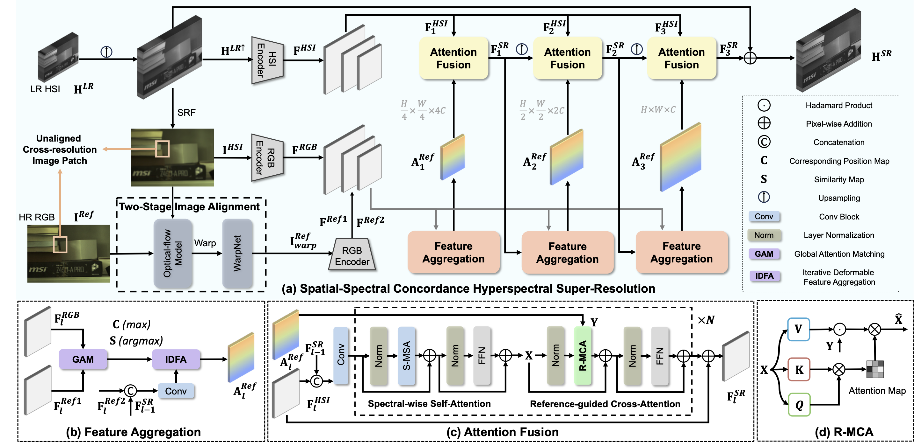

# SSC-HSR
Unaligned RGB Guided Hyperspectral Image Super-Resolution with Spatial-Spectral Concordance, International Journal of Computer Vision (IJCV), 2025. 

## Abstract

Hyperspectral images (HSIs) super-resolution (SR) aims to improve the spatial resolution, yet its performance is often limited at high-resolution ratios. 
The recent adoption of high-resolution reference images for super-resolution is driven by the poor spatial detail found in low-resolution HSIs, presenting it as a favorable method.
However, these approaches cannot effectively utilize information from the reference image, due to the inaccuracy of alignment and its inadequate interaction between alignment and fusion modules.
In this paper, we introduce a \textbf{S}patial-\textbf{S}pectral \textbf{C}oncordance \textbf{H}yperspectral \textbf{S}uper-\textbf{R}esolution (SSC-HSR) framework for unaligned reference RGB guided HSI SR to address the issues of inaccurate alignment and poor interactivity of the previous approaches.
Specifically, to ensure spatial concordance, \ie, align images more accurately across resolutions and refine textures, we construct a Two-Stage Image Alignment (TSIA) with a synthetic generation pipeline in the image alignment module, where the fine-tuned optical flow model can produce a more accurate optical flow in the first stage and warp model can refine damaged textures in the second stage.
To enhance the interaction between alignment and fusion modules and ensure spectral concordance during reconstruction, we propose a Feature Aggregation (FA) module and an Attention Fusion (AF) module. 
In the feature aggregation module, we introduce an Iterative Deformable Feature Aggregation (IDFA) block to achieve significant feature matching and texture aggregation with the fusion multi-scale results guidance, iteratively generating learnable offset. 
Besides, we introduce two basic spectral-wise attention blocks in the attention fusion module to model the inter-spectra interactions.
Extensive experiments on three natural or remote-sensing datasets show that our method outperforms state-of-the-art approaches on both quantitative and qualitative evaluations.

## Contribution

1. We propose a network, named SSC-HSR, for unaligned RGB guided hyperspectral super-resolution, which can well handle joint of alignment and super-resolution. Both quantitative and qualitative experiments on three hyperspectral datasets demonstrate the performance of our method.
2. We introduce a two-stage image alignment process complemented by a synthetic generation pipeline. It first fine-tunes the optical flow model, ensuring the generation of precise optical flow. Subsequently, it employs a warp model aimed at refining the image texture details, taking into account the cross-resolution and distribution disparities of the data.
3. We introduce an iterative deformable feature aggregation block in the feature aggregation module. This block is designed to learn finer-grained spatial offsets and relevant feature aggregation through progressively enhanced interaction with the fusion model. Additionally, the fusion model employs reference-guided attention to model spectral-wise dependencies, ensuring spectral concordance.

## Method




## Results

### Visual results


### Quantitative results


## Requirement

- The example tasks requires `PyTorch <= 1.7`.
- The package `tfpnp` itself can be used for higher version of PyTorch.

## How to use
Download or clone the repository:

`git clone https://github.com/BITYKZhang/RLPnP`

Go into the directory "/RLPnP":

`cd RLPnP`

Configure the packages:

`pip install -e`

This implementation is based on / inspired by:

<a href="https://github.com/Vandermode/TFPnP">TFPnP</a>


## Citation

If you find our work useful for your research, please consider citing the following paper

```bibtex
@inproceedings{fu2022reinforcement,
  title={Reinforcement learning based plug-and-play method for hyperspectral image reconstruction},
  author={Fu, Ying and Zhang, Yingkai},
  booktitle={CAAI International Conference on Artificial Intelligence},
  pages={466--477},
  year={2022},
  organization={Springer}
}
```
