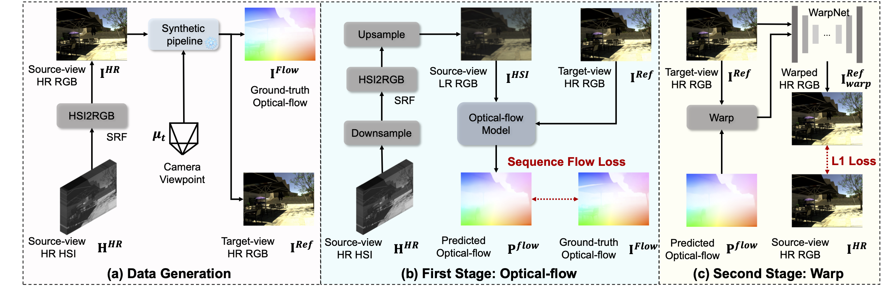

<p align="center">
  <h1 align="center">Unaligned RGB Guided Hyperspectral Image Super-Resolution with Spatial-Spectral Concordance (Official)</h1>
  
  <p align="center">
    <a href="https://github.com/BITYKZhang">Yingkai Zhang</a>, 
    <a href="https://zeqiang-lai.github.io/">Zeqiang Lai</a>, 
    <a href="http://iipl.net.cn/index/team_details/id/140.aspx">Tao Zhang</a>,
    <a href="https://ying-fu.github.io/">Ying Fu</a>*.
    <a href="https://igsnrr.cas.cn/sourcedb/zw/dsjs/bssds/dtxydlxx/200906/t20090626_1842630.html">Chenghu Zhou</a>.
      (*Corresponding author)
  </p>
  <h2 align="center">IJCV 2025</h2>

  <h3 align="center">
    <a href="https://github.com/BITYKZhang/SSC-HSR/" target='_blank'></a>
    <a href="https://link.springer.com/article/10.1007/s11263-025-02466-8" target='_blank'></a>
    <a href="https://arxiv.org/abs/2505.02109" target='_blank'></a>
  </h3>

</p>

This repository contains the official PyTorch implementation of "*Unaligned RGB Guided Hyperspectral Image Super-Resolution with Spatial-Spectral Concordance*" accepted at **IJCV 2025.**

## News :sparkles:

- [x] 2025-07-04: Release code and example checkpoints.
- [x] 2025-07-01: Update README.
- [x] 2025-06-17: Published online [Springer](https://link.springer.com/article/10.1007/s11263-025-02466-8).
- [x] 2025-05-04: Upload for [Arxiv](https://arxiv.org/abs/2505.02109).

## Framework

<div align="center">
  
</div>

## Contribution

1. We propose a network, named SSC-HSR, for unaligned RGB guided hyperspectral super-resolution, which can well handle joint of alignment and super-resolution. Both quantitative and qualitative experiments on three hyperspectral datasets demonstrate the performance of our method.
2. We introduce a two-stage image alignment process complemented by a synthetic generation pipeline. It first fine-tunes the optical flow model, ensuring the generation of precise optical flow. Subsequently, it employs a warp model aimed at refining the image texture details, taking into account the cross-resolution and distribution disparities of the data.
3. We introduce an iterative deformable feature aggregation block in the feature aggregation module. This block is designed to learn finer-grained spatial offsets and relevant feature aggregation through progressively enhanced interaction with the fusion model. Additionally, the fusion model employs reference-guided attention to model spectral-wise dependencies, ensuring spectral concordance.

## Setting

### 1. Clone the Repository

```
git clone https://github.com/BITYKZhang/SSC-HSR.git
cd SSC-HSR
```

### 2. Create the Environment 

Install the dependency via `create_env.sh`

```
conda create -n torch1.10 python=3.7
conda activate torch1.10
conda install pytorch torchvision torchaudio cudatoolkit=11.3 -c pytorch
conda install -c conda-forge opencv
pip install -r requirements.txt
```

### 3. Prepare Data

Download datasets and put into `data/`

Flower dataset [here](https://github.com/Zeqiang-Lai/HSI-RefSR), Real dataset [here](https://github.com/Zeqiang-Lai/HSI-RefSR), Chikusei dataset [here](https://www.sal.t.u-tokyo.ac.jp/hyperdata/)

The ICVL dataset [here](https://icvl.cs.bgu.ac.il/pages/researches/hyperspectral-imaging.html) is used in the proposed synthetic generation pipeline (two-stage image alignment).

## Training

### 1. Traning for Two-Stage Image Alignment Module

Follow the work [MPI-Flow](https://github.com/Sharpiless/MPI-Flow), we use the synthetic code for a target view, which has an accurate optical flow with the source view. The accurate optical flow with paired HSIs can be used for training optical flow model [RAFT](https://github.com/princeton-vl/RAFT). 

- Use [MiDaS](https://github.com/isl-org/MiDaS) for HSI (convert to RGB) to estimate the depth maps.
- Use [MPI-Flow](https://github.com/Sharpiless/MPI-Flow) for HSI (convert to RGB) to generate the new view (RGB) with accurate optical flow.
- Use different degradation operations to generate LR HSI (convert to RGB), and then training the optical flow model [RAFT](https://github.com/princeton-vl/RAFT) and the WarpNet for better warped HSI.
- The pre-trained checkpoints can be downloaded [Here](https://drive.google.com/drive/folders/19kvaEk97Jgp1svpPBsqD0U7GKVJGgiBb?usp=sharing) and put into `SSC-HSR/source/model/refsr/SSCHSR/pretrained`.

<div align="center">
  
</div>

### 2. Traning for Whole Framework

For example, train on real HSI fusion dataset at the scale factor of 8.

```shell
python run.py train -s results/refsr/real/sf8/Ours -c results/refsr/real/sf8/Ours/config.yaml
```

The example checkpoint and config can be downloaded [Here](https://drive.google.com/drive/folders/19kvaEk97Jgp1svpPBsqD0U7GKVJGgiBb?usp=sharing) and put into `SSC-HSR/results/refsr/real/sf8/Ours/ckpt` and `SSC-HSR/results/refsr/real/sf8/Ours`.

## Inference and Evaluation

For example, test on real HSI fusion dataset at the scale factor of 8.

```shell
python run.py test -s results/refsr/real/sf8/Ours -r best
```

## Citation

If you find our work useful for your research, please consider citing the following paper

```bibtex
@article{zhang2025unaligned,
  title={Unaligned RGB Guided Hyperspectral Image Super-Resolution with Spatial-Spectral Concordance},
  author={Zhang, Yingkai and Lai, Zeqiang and Zhang, Tao and Fu, Ying and Zhou, Chenghu},
  journal={International Journal of Computer Vision},
  pages={1--21},
  year={2025},
  publisher={Springer}
}
```

## Acknowledgments
- The code is heavily borrowed from [HSI-RefSR](https://github.com/Zeqiang-Lai/HSI-RefSR), [MPI-Flow](https://github.com/Sharpiless/MPI-Flow), and [DATSR](https://github.com/caojiezhang/DATSR), we thank the authors for their great effort.